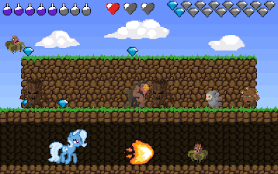
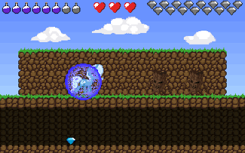

# 16-битная игра "Трикси и алмазы" для MS-DOS, на основе QuickBasic 4.5 и NASM

[](https://yoomoney.ru/to/41001497003495)
[](https://boosty.to/ponygames)
[](https://tav-developer.itch.io)
[](#)
[](#)
[](#)

## О проекте

Игра реализована как 16-битное приложение для реального режима MS-DOS, запуск
в эмуляторах также поддерживается.\
Задача игры - собрать на экране заданное количество алмазов, избегая контакта
с монстрами. Трикси может ходить, телепортироваться между платформами, использовать
файербол и щит. Эти действия расходуют ману.\
На высоком уровне сложности мана восстанавливается медленнее.

 

## Состав репозитория

* `bin` - каталог контента игры (графика, звуки, тексты), также содержит исполняемые файлы
* `graphics` - иконки игры для дистрибутива и AppImage
* `setup` - скрипты создания архива для DOS, дистрибутивов/архивов для Windows, AppImage для Linux и архивов/DMG для MacOS
* `source` - исходный код игры для QuickBasic 4.5

## Инструменты сборки

Для сборки проекта нужен установленный QuickBasic 4.5 и ассемблер [NASM](https://nasm.us/).
Также потребуется графическая библиотека [QbGraTools](https://github.com/tereshenkovav/QbGraTools), v1.1.0

Создание дистрибутива для Windows выполняется с помощью программы
[NSIS](https://nsis.sourceforge.io)

Создание архива для Windows выполняется с помощью скриптовой утилиты построения архивов
[SmartZipBuilder](https://github.com/tereshenkovav/SmartZipBuilder)

Для создания AppImage под Linux необходим инструмент сборки AppImageKit -
[appimagetool-x86_64.AppImage](https://github.com/AppImage/AppImageKit/releases)

## Сборка, запуск игры и создание дистрибутивов

### Сборка

Для сборки можно использовать виртуальную машину с DOS/FreeDOS или же DOSBox, подключив в нём каталог, в котором доступны QuickBasic, NASM и файлы проекта.
В каталог QuickBasic надо скопировать Файлы графической библиотеки QbGraTools -
```
gratools.qlb
gratools.lib
gratools.bi
```
Теперь можно компилировать сам проект игры. Для этого надо скопировать файлы из каталога `source`
в каталог QuickBasic и запустить скрипт `build.bat`.
При правильной сборке, в каталоге появятся файлы `GAME.EXE` и `GAME_FPU.EXE`.
Первый файл предназначен для компьютеров без математического сопроцессора 8087,
второй может запускаться на любом x86-совместимом компьютере, где есть установленный сопроцессор.
Для запуска в DOSBox можно использовать любой из полученных файлов.

Если необходимо открыть проект игры в QuickBasic IDE, то сначала надо скопировать
каталог `bin\data` в каталог установленного QuickBasic, после чего запустить
IDE командой, которая подгрузит графическую библиотеку.

```
qb.exe /l gratools.qlb trixie.bas
```

Скопированный каталог `data` позволит запускать игру в режиме отладки прямо из IDE.

### Запуск

Для запуска игры нужно скопировать полученные файлы `GAME.EXE` или `GAME_FPU.EXE`
в каталог `bin`, поcле чего запустить исполнимый файл.
В файле `data\options` можно включить опции показа FPS в игре или вывода отладочной информации,
раскомментировав соответствующие строки.

### Создание дистрибутивов

**ВАЖНО**: при создании дистрибутивов, информация о версии, ветке и коммите берется
из репозитория git, поэтому все описанные ниже команды будут работать корректно
только при вызове из каталога-репозитория git и при наличии установленного git.

Перед началом создания дистрибутивов нужно обязательно скопировать
бинарные файлы `GAME.EXE` и `GAME_FPU.EXE` в каталог `bin`. Для создания дистрибутивов не требуется DOS или DOSBox, они создаются в Windows и Linux.

Создание архива для DOS или для DOSBox выполняется автоматически при
запуске файла `build.bat` из каталога `setup/dos`.

Создание архива и дистрибутива для Windows выполняется автоматически при
запуске файла `build.bat` из каталога `setup/windows`
(может потребоваться указать путь к компилятору NSIS). И архив, и дистрибутив
включают в себя эмулятор DOSBox. Его файлы уже находятся в каталоге `setup/windows`,
дополнительно устанавливать не нужно.

Создание AppImage под Linux выполняется автоматически при
запуске файла `build64.sh`, из каталога `setup/linux` если
установлен AppImageKit и исполнимый файл DOSBox находится по пути `/usr/bin/dosbox`.

Создание архива приложения и образа DMG под MacOS выполняется автоматически при
запуске файла `make_app.sh`, из каталога `setup/mac`.
Необходимые файлы DOSBox уже находятся в каталоге проекта.
